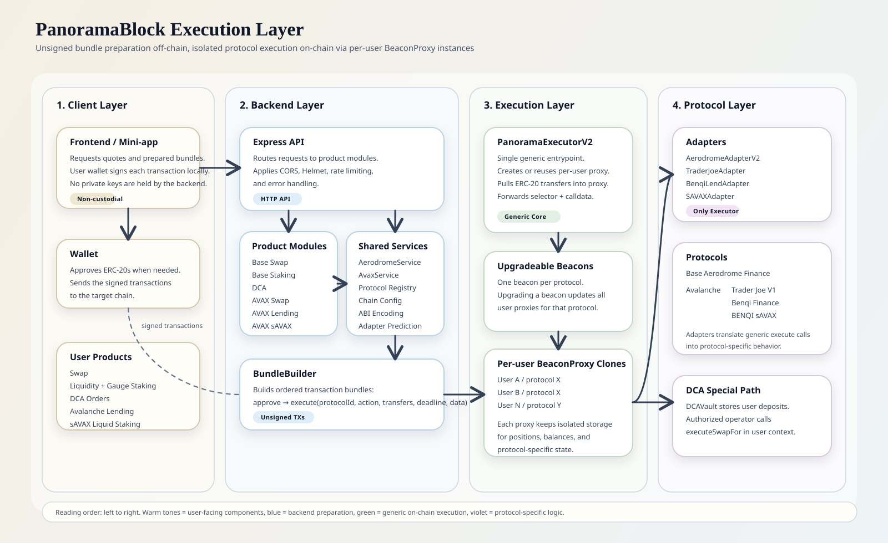
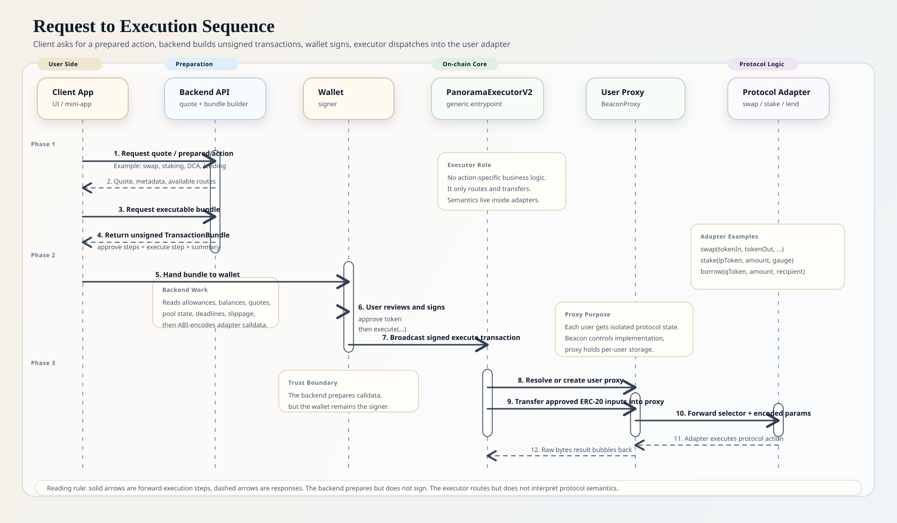

# PanoramaBlock Execution Layer

Non-custodial, **upgradeable** DeFi execution infrastructure for **Base** and **Avalanche C-Chain**. A protocol-neutral executor routes all operations through per-user BeaconProxy clones — the backend prepares unsigned transaction bundles and the user's wallet signs everything client-side.

## Supported Chains & Protocols

| Chain | Protocol | Products |
|---|---|---|
| **Base (8453)** | Aerodrome Finance | Swap, Liquidity Provision, Gauge Staking, DCA |
| **Avalanche (43114)** | Trader Joe V1 | Swap (auto-routes through WAVAX) |
| **Avalanche (43114)** | Benqi Finance | Supply, Borrow, Repay (ERC-20 + native AVAX) |
| **Avalanche (43114)** | BENQI sAVAX | Liquid Staking (stake, unlock, redeem) |

---

## Architecture



### Execution Flow



### How It Works

1. **User** requests a DeFi action (e.g., "swap 1 WETH for USDC" or "supply 100 USDC to Benqi")
2. **Backend** queries on-chain state (allowances, reserves, balances, rates)
3. **Backend** builds an ordered `TransactionBundle` via `BundleBuilder`
4. **Frontend** receives the bundle and signs each transaction with the user's wallet
5. **ExecutorV2** creates or reuses a **BeaconProxy** for the user + protocol
6. The proxy delegates to the adapter implementation — each user's positions are fully isolated

> **The backend never holds private keys.** It only prepares unsigned calldata.

### Upgradeable (BeaconProxy + UUPS)

**Adapters** use OpenZeppelin's **BeaconProxy** pattern:
- Each protocol has an `UpgradeableBeacon` storing the current adapter implementation
- Each user gets a `BeaconProxy` that delegates all calls to the beacon's implementation
- **To upgrade**: `beacon.upgradeTo(newImplAddress)` — updates ALL user proxies at once
- Adapters use `Initializable` + `__gap[50]` for safe storage across upgrades
- Zero downtime, zero user migration needed

**DCAVault** uses **UUPS Proxy** (ERC1967Proxy + UUPSUpgradeable):
- Singleton vault deployed behind a proxy — storage persists across upgrades
- `vault.upgradeToAndCall(newImpl, "")` — zero order migration
- `__gap[40]` reserved for future state variables
- All admin changes (keeper, executor, owner) require **1-day delay** + acceptance by proposed address

### Protocol-Neutral Executor

The executor has a single entry point with **zero knowledge** of specific actions:

```solidity
function execute(
    bytes32 protocolId,     // e.g. keccak256("aerodrome"), keccak256("benqi")
    bytes4 action,          // Solidity function selector
    Transfer[] transfers,   // tokens to pull into the user's proxy
    uint256 deadline,
    bytes data              // ABI-encoded adapter function parameters
) external payable returns (bytes memory)
```

It only:
1. Creates/retrieves the user's BeaconProxy for the given `protocolId`
2. Pulls ERC-20 tokens from the user into the proxy
3. Calls `proxy.call(action ++ data)` — raw dispatch to the adapter

This means:
- **New protocol** → deploy adapter + beacon, call `registerBeacon()`. Zero executor changes.
- **New action** → implement on the adapter. Zero executor changes.
- **Upgrade adapter** → `beacon.upgradeTo(newImpl)`. Zero executor changes.
- **The executor never needs redeployment** as the protocol ecosystem grows.

---

## Deployed Contracts

### Base Mainnet (8453)

| Contract | Address |
|---|---|
| PanoramaExecutorV2 | [`0x7528861E7DD09dc9B1e5149542e897d984Ceda7f`](https://basescan.org/address/0x7528861E7DD09dc9B1e5149542e897d984Ceda7f) |
| Aerodrome UpgradeableBeacon | [`0xC8649c9F6F590f20Ab477c0F7e2516CF287E6899`](https://basescan.org/address/0xC8649c9F6F590f20Ab477c0F7e2516CF287E6899) |
| AerodromeAdapterV2 (impl) | [`0x5921371c5071A968d431a06ce7Fc20b868D38E31`](https://basescan.org/address/0x5921371c5071A968d431a06ce7Fc20b868D38E31) |
| DCAVault (V1, non-upgradeable) | [`0x155eC4256cC6f11f3d4C21Af28a2a1CC31f730d1`](https://basescan.org/address/0x155eC4256cC6f11f3d4C21Af28a2a1CC31f730d1) |
| DCAVault (V2, UUPS Proxy) | Pending redeployment |

### Avalanche C-Chain (43114)

| Contract | Address |
|---|---|
| PanoramaExecutorV2 | [`0xc35059D1BC395Ff0F6fDcEA1b7F365E3aa7C1D12`](https://snowtrace.io/address/0xc35059D1BC395Ff0F6fDcEA1b7F365E3aa7C1D12) |
| TraderJoe UpgradeableBeacon | [`0x3748845D93617Ef2Df055D4fD406e701fF009266`](https://snowtrace.io/address/0x3748845D93617Ef2Df055D4fD406e701fF009266) |
| TraderJoeAdapter (impl) | [`0xfFc784bF101e5875304501dC883Ee87CcE20C104`](https://snowtrace.io/address/0xfFc784bF101e5875304501dC883Ee87CcE20C104) |
| Benqi UpgradeableBeacon | [`0xD395272853D8ed0ce01f3692e62d8712426C6f97`](https://snowtrace.io/address/0xD395272853D8ed0ce01f3692e62d8712426C6f97) |
| BenqiLendAdapter (impl) | [`0x7d16Ca2CfccAc9335a36b8063EB33E472f316BD5`](https://snowtrace.io/address/0x7d16Ca2CfccAc9335a36b8063EB33E472f316BD5) |
| sAVAX UpgradeableBeacon | [`0xf9a68cb1e9758b1Ea041dB418DFdF818033c2Fcb`](https://snowtrace.io/address/0xf9a68cb1e9758b1Ea041dB418DFdF818033c2Fcb) |
| SAVAXAdapter (impl) | [`0x8476bE90017697D4947dbEEa5372456d9D31A453`](https://snowtrace.io/address/0x8476bE90017697D4947dbEEa5372456d9D31A453) |

---

## Project Structure

```
execution-layer/
├── contracts/
│   ├── aerodrome/                          # Base chain
│   │   ├── core/
│   │   │   ├── PanoramaExecutorV2.sol      # Upgradeable executor (BeaconProxy)
│   │   │   └── DCAVault.sol                # Automated DCA orders
│   │   └── adapters/
│   │       └── AerodromeAdapterV2.sol      # Swap, liquidity, staking
│   │
│   └── avax/                               # Avalanche chain
│       └── adapters/
│           ├── TraderJoeAdapter.sol         # Swap (Trader Joe V1)
│           ├── BenqiLendAdapter.sol         # Lending (Benqi Finance)
│           └── SAVAXAdapter.sol             # Liquid staking (sAVAX)
│
├── backend/
│   └── src/
│       ├── config/
│       │   ├── chains.ts                   # Base + Avalanche chain configs
│       │   └── protocols.ts                # Protocol registry + adapter cache
│       ├── shared/
│       │   ├── bundle-builder.ts           # BundleBuilder + all ADAPTER_SELECTORS
│       │   └── services/
│       │       ├── aerodrome.service.ts    # Base on-chain reads
│       │       └── avax.service.ts         # Avalanche on-chain reads
│       ├── utils/
│       │   ├── abi.ts                      # All contract ABIs
│       │   └── encoding.ts                # protocolId encoding, slippage, deadlines
│       └── modules/
│           ├── swap/                       # Base — Aerodrome swap
│           ├── liquid-staking/             # Base — Gauge staking
│           ├── dca/                        # Base — DCA automation
│           ├── avax-swap/                  # Avalanche — Trader Joe swap
│           ├── avax-lending/               # Avalanche — Benqi lending
│           └── avax-liquid-staking/        # Avalanche — sAVAX liquid staking
│
├── script/
│   ├── DeployV2.s.sol                      # Base V2 deployment
│   ├── DeployDCAVault.s.sol                # DCA vault deployment
│   └── avax/
│       └── DeployAvaxV2.s.sol              # Avalanche V2 deployment
│
└── test/
    ├── PanoramaExecutor.t.sol
    ├── DCAVault.t.sol
    └── avax/
```

---

## Getting Started

### Prerequisites

- [Node.js](https://nodejs.org/) >= 18
- [Foundry](https://book.getfoundry.sh/)

### Install

```bash
forge install
cd backend && npm install
```

### Environment

```env
# Root .env (Foundry deployment)
PRIVATE_KEY=<deployer-private-key>
BASE_RPC_URL=https://mainnet.base.org
AVAX_RPC_URL=https://api.avax.network/ext/bc/C/rpc

# backend/.env (Express API)
PORT=3010
BASE_RPC_URL=https://mainnet.base.org
AVAX_RPC_URL=https://api.avax.network/ext/bc/C/rpc
EXECUTOR_ADDRESS=0x7528861E7DD09dc9B1e5149542e897d984Ceda7f
AVAX_EXECUTOR_ADDRESS=0xc35059D1BC395Ff0F6fDcEA1b7F365E3aa7C1D12
DCA_VAULT_ADDRESS=0x155eC4256cC6f11f3d4C21Af28a2a1CC31f730d1
```

### Run

```bash
# Docker (recommended)
docker compose up -d --build

# Or locally
cd backend && npm run dev
```

### Deploy Contracts

```bash
# Base
source .env
forge script script/DeployV2.s.sol:DeployV2 --rpc-url $BASE_RPC_URL --broadcast

# Avalanche
forge script script/avax/DeployAvaxV2.s.sol:DeployAvaxV2 --rpc-url $AVAX_RPC_URL --broadcast
```

### Deploy DCAVault (UUPS Proxy)

```bash
source .env
forge script script/DeployDCAVault.s.sol:DeployDCAVault --rpc-url $BASE_RPC_URL --broadcast
```

### Upgrade an Adapter

```bash
# Deploy new implementation, then call:
beacon.upgradeTo(newImplAddress)
# All user proxies are updated instantly — zero migration needed.
```

### Upgrade DCAVault

```bash
# Deploy new implementation, then owner calls via proxy:
vault.upgradeToAndCall(newImplAddress, "")
# Storage preserved, logic updated, zero order migration.
```

### Tests

```bash
# Solidity unit tests (no RPC needed)
forge test -vv --no-match-path "test/fork/*"

# Fork tests (requires RPC)
BASE_RPC_URL=https://mainnet.base.org forge test --match-path "test/fork/*" -vvv

# Backend (Vitest) — 138 tests
cd backend && npm test
```

---

## API Endpoints

### Base — Swap (`/swap`)

| Method | Endpoint | Description |
|---|---|---|
| `GET` | `/swap/pairs` | Available trading pairs with on-chain reserves |
| `POST` | `/swap/quote` | Price quote with exchange rate |
| `POST` | `/swap/prepare` | Transaction bundle: [approve] → execute(swap) |

### Base — Liquid Staking (`/staking`)

| Method | Endpoint | Description |
|---|---|---|
| `GET` | `/staking/pools` | Pools with live on-chain data |
| `GET` | `/staking/protocol-info` | APR and TVL per pool |
| `GET` | `/staking/position/:address` | User staked positions and pending rewards |
| `GET` | `/staking/portfolio/:address` | Full portfolio with wallet balances |
| `POST` | `/staking/prepare-enter` | Bundle: approve → addLiquidity → stake |
| `POST` | `/staking/prepare-exit` | Bundle: unstake → removeLiquidity |
| `POST` | `/staking/prepare-claim` | Claim AERO rewards |

### Base — DCA (`/dca`)

| Method | Endpoint | Description |
|---|---|---|
| `POST` | `/dca/prepare-create` | Bundle: approve → createOrder |
| `POST` | `/dca/prepare-cancel` | Bundle: cancel → withdraw remaining |
| `GET` | `/dca/orders/:address` | User's DCA orders |
| `GET` | `/dca/executable` | Orders ready to execute (keeper) |

### External Swap Provider API (`/provider/swap`)

Used by the Liquid Swap Service's Aerodrome adapter for Base same-chain swaps.

| Method | Endpoint | Description |
|---|---|---|
| `POST` | `/provider/swap/supports` | Check if Aerodrome supports a given swap route |
| `POST` | `/provider/swap/quote` | Get a swap quote (estimated output, exchange rate) |
| `POST` | `/provider/swap/prepare` | Prepare swap transactions for user signature |

### Avalanche — Swap (`/avax/swap`)

| Method | Endpoint | Description |
|---|---|---|
| `GET` | `/avax/swap/pairs` | Supported Trader Joe pairs |
| `POST` | `/avax/swap/quote` | Price quote with path routing |
| `POST` | `/avax/swap/prepare` | Bundle: [approve] → execute(swapWithPath) |

### Avalanche — Lending (`/avax/lending`)

| Method | Endpoint | Description |
|---|---|---|
| `GET` | `/avax/lending/markets` | Benqi markets with live supply/borrow rates |
| `GET` | `/avax/lending/position/:address` | User positions (supplied, borrowed) |
| `POST` | `/avax/lending/prepare-supply` | Bundle: [approve] → execute(supply) |
| `POST` | `/avax/lending/prepare-redeem` | Bundle: [approve] → execute(redeem) |
| `POST` | `/avax/lending/prepare-borrow` | Bundle: execute(borrow) |
| `POST` | `/avax/lending/prepare-repay` | Bundle: [approve] → execute(repay) |

### Avalanche — Liquid Staking (`/avax/liquid-staking`)

| Method | Endpoint | Description |
|---|---|---|
| `GET` | `/avax/liquid-staking/position/:address` | sAVAX balance and exchange rate |
| `POST` | `/avax/liquid-staking/prepare-stake` | Bundle: execute(stake) with AVAX |
| `POST` | `/avax/liquid-staking/prepare-request-unlock` | Bundle: [approve sAVAX] → execute(requestUnlock) |
| `POST` | `/avax/liquid-staking/prepare-redeem` | Bundle: execute(redeem) |

---

## Adapters

### Base — AerodromeAdapterV2

Aerodrome Finance integration (Router2 + Voter + Gauges).

| Action | Selector |
|---|---|
| Swap | `swap(address,address,uint256,uint256,address,bool)` |
| Add Liquidity | `addLiquidity(address,address,bool,uint256,uint256,uint256,uint256,address)` |
| Remove Liquidity | `removeLiquidity(address,address,bool,uint256,uint256,uint256,address,address)` |
| Stake LP | `stake(address,uint256,address)` |
| Unstake LP | `unstake(address,uint256,address,address)` |
| Claim Rewards | `claimRewards(address,address,address)` |

### Avalanche — TraderJoeAdapter

Trader Joe V1 swap with automatic routing through WAVAX.

| Action | Selector |
|---|---|
| Swap | `swap(address,address,uint256,uint256,address)` |
| Multi-hop Swap | `swapWithPath(uint256,uint256,address[],address)` |

### Avalanche — BenqiLendAdapter

Per-user isolated lending on Benqi Finance. Supports ERC-20 and native AVAX.

| Action | Selector |
|---|---|
| Supply ERC-20 | `supply(address,uint256,address)` |
| Redeem ERC-20 | `redeem(address,uint256,address)` |
| Borrow ERC-20 | `borrow(address,uint256,address)` |
| Repay ERC-20 | `repay(address,uint256)` |
| Supply AVAX | `supplyAVAX(address)` payable |
| Redeem AVAX | `redeemAVAX(uint256,address)` |
| Borrow AVAX | `borrowAVAX(uint256,address)` |
| Repay AVAX | `repayAVAX()` payable |
| Enter Markets | `enterMarkets(address[])` |

### Avalanche — SAVAXAdapter

BENQI liquid staking (sAVAX).

| Action | Selector |
|---|---|
| Stake AVAX | `stake(address)` payable |
| Request Unlock | `requestUnlock(uint256)` |
| Redeem | `redeem(uint256,address)` |

---

## Adding a New Protocol

### 1. Write the adapter

```solidity
contract MyAdapterV2 is Initializable {
    address public executor;
    uint256[50] private __gap;

    modifier onlyExecutor() {
        require(msg.sender == executor, "only executor");
        _;
    }

    function initializeFull(address _executor, bytes calldata _initArgs) external initializer {
        executor = _executor;
        // decode _initArgs as needed
    }

    function myAction(...) external onlyExecutor returns (...) {
        // protocol logic
    }

    receive() external payable {}
}
```

### 2. Deploy beacon and register

```solidity
MyAdapterV2 impl = new MyAdapterV2();
UpgradeableBeacon beacon = new UpgradeableBeacon(address(impl), deployer);
executor.registerBeacon(keccak256("myprotocol"), address(beacon), abi.encode(initArgs));
```

### 3. Add backend module

```typescript
// config/protocols.ts
registerProtocol("myprotocol", {
  protocolId: "myprotocol",
  chain: "avalanche",
  contracts: { router: "0x..." },
});

// shared/bundle-builder.ts
export const MY_SELECTORS = {
  MY_ACTION: ethers.id("myAction(address,uint256)").slice(0, 10),
} as const;
```

No changes needed to the executor or BundleBuilder core.

---

## Tech Stack

| Component | Technology |
|---|---|
| Smart Contracts | Solidity 0.8.24, Foundry, OpenZeppelin v5 (BeaconProxy + Initializable) |
| Backend | Node.js, Express, ethers.js v6, TypeScript |
| Testing | Foundry (Solidity), Vitest (TypeScript) |
| Chains | Base (8453), Avalanche C-Chain (43114) |
| Protocols | Aerodrome Finance, Trader Joe, Benqi Finance, BENQI sAVAX |
