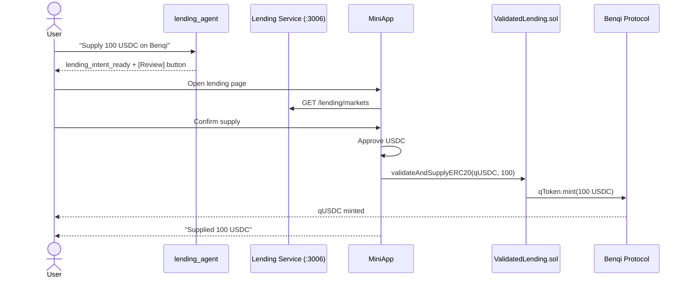

# Lending Execution Sequence

## Diagram

See [diagrams/lending-sequence.mmd](../diagrams/lending-sequence.mmd) for the full Mermaid source.

## Step-by-Step: Supply

1. User says "Supply 100 USDC on Benqi" or navigates to /lending.
2. lending_agent collects intent (action=supply, token=USDC, amount=100).
3. MiniApp fetches market data (rates, liquidity, health factors).
4. User reviews: amount, APY, protocol.
5. First tx: approve ValidatedLending contract for USDC.
6. Second tx: call validateAndSupplyERC20(qTokenAddress, 100).
7. Contract pays validation tax, supplies to Benqi, mints qUSDC.
8. User receives interest-bearing qUSDC.

## Step-by-Step: Borrow

1. User selects "Borrow" mode.
2. Must have existing supply position (collateral).
3. Selects borrow token and amount.
4. MiniApp shows health factor impact.
5. Transaction: validateAndBorrow(qTokenAddress, borrowAmount).
6. Borrowed tokens received. Health factor updated.
