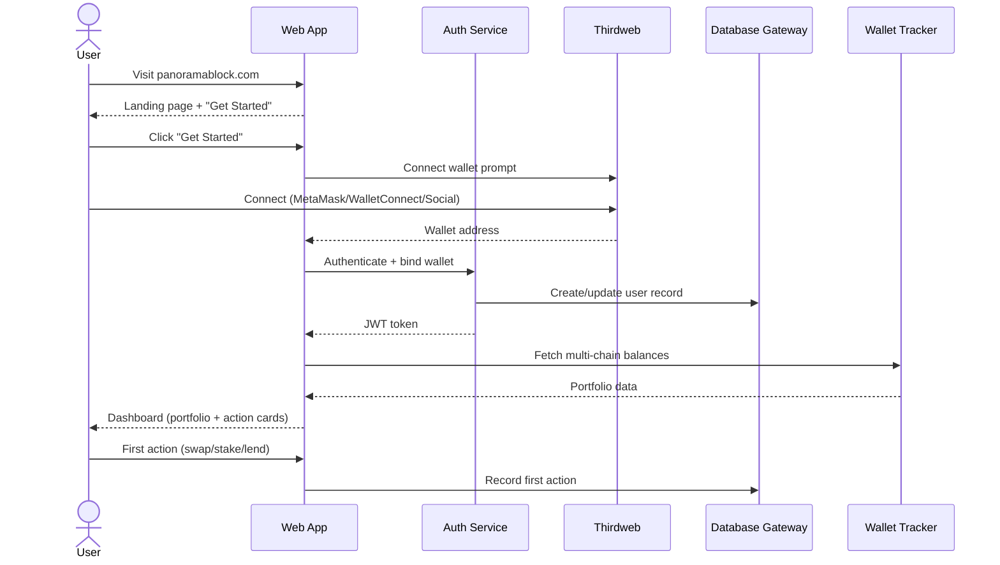

# Onboarding Sequence: Site

## Walkthrough

1. User visits the web application.
2. Landing page explains what PanoramaBlock does.
3. User clicks "Get Started".
4. Wallet connection modal appears (Thirdweb: MetaMask, WalletConnect, social login).
5. User connects wallet.
6. Auth service validates and creates user record.
7. Wallet tracker fetches balances across supported chains.
8. Dashboard shows portfolio overview and suggested first actions.
9. Based on wallet contents: suggest swap (has tokens), stake (has ETH), or fund wallet (empty).
10. User completes first action. Onboarding state updated.
