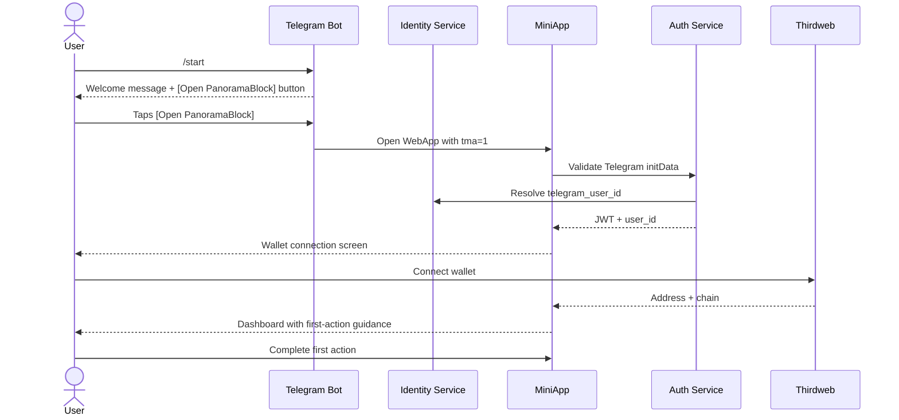

# Onboarding Sequence: Telegram

## Walkthrough

1. User sends /start to the PanoramaBlock Telegram bot.
2. Bot replies with welcome message explaining capabilities.
3. Inline buttons: [Open PanoramaBlock], [What can you do?], [Help]
4. User taps [Open PanoramaBlock], MiniApp opens within Telegram.
5. MiniApp validates Telegram WebApp initData for authentication.
6. User identity resolved (telegram_user_id -> internal user_id).
7. If first visit: wallet connection screen. Else: dashboard.
8. User connects wallet (Thirdweb embedded or external).
9. Dashboard shows portfolio and suggested actions.
10. User completes first action (guided flow with tooltips).
11. Returns to chat. Bot can continue conversation about next steps.

## Chat-First Flow (Alternative)

1. User sends /start.
2. Instead of opening MiniApp, types: "I want to swap ETH for USDC"
3. Bot forwards to agents, swap_agent collects intent.
4. Bot sends [Review Swap] button linking to MiniApp with pre-filled params.
5. User taps button, signs in MiniApp, returns to chat.
