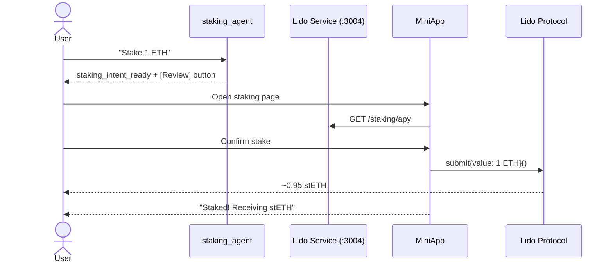

# Staking Execution Sequence

## Diagram

See [diagrams/staking-sequence.mmd](../diagrams/staking-sequence.mmd) for the full Mermaid source.

## Step-by-Step: Stake

1. User says "Stake 1 ETH" via chat or navigates to /staking.
2. staking_agent collects intent, emits staking_intent_ready.
3. MiniApp fetches current Lido APY from lido-service.
4. User reviews: amount, expected stETH, APY.
5. Transaction prepared: Lido submit() with 1 ETH value.
6. User signs via Thirdweb.
7. stETH minted to user's wallet.
8. Transaction tracked via Gateway API.

## Step-by-Step: Unstake (Queue)

1. User selects "Unstake" mode.
2. Enters stETH amount.
3. Transaction: Lido requestWithdrawals([amount]).
4. Returns withdrawal request ID.
5. User waits ~7 days for finalization.
6. User claims via claimWithdrawal(requestId).
7. ETH received.

## Step-by-Step: Unstake (Instant)

1. User selects "Instant Unstake".
2. Enters stETH amount. Fee shown.
3. First tx: approve stETH spending.
4. Second tx: execute instant unstake.
5. ETH received immediately (minus fee).
