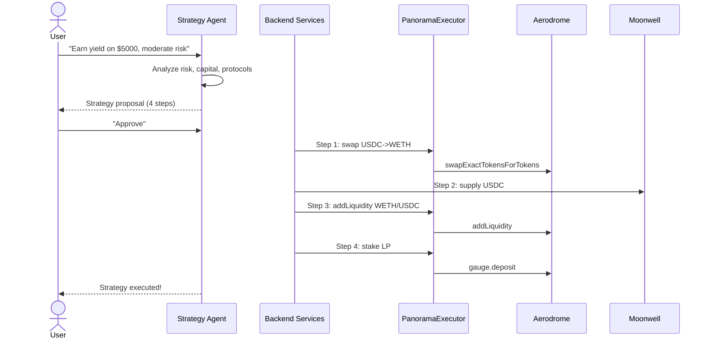

# Strategy Agent Sequence

## Diagram

See [diagrams/defi-strategy-sequence.mmd](../diagrams/defi-strategy-sequence.mmd) for the full Mermaid source.

## Step-by-Step

1. User expresses a financial goal in natural language.
2. Strategy Agent analyzes: risk profile, capital, target chain, available protocols.
3. Agent constructs multi-step strategy proposal with expected outcomes.
4. User reviews and approves.
5. Each step executes sequentially as separate transactions.
6. User signs each transaction via Thirdweb.
7. Agent tracks progress and reports completion.
8. Portfolio updated with new positions.
