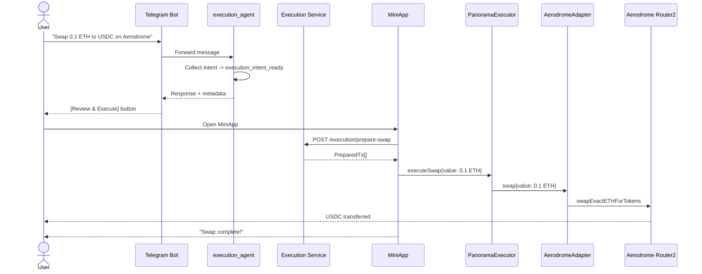

# Swap Execution Sequence

## Diagram

See [diagrams/swap-sequence.mmd](../diagrams/swap-sequence.mmd) for the full Mermaid source.

## Step-by-Step Walkthrough

1. **User sends message**: "Swap 0.1 ETH to USDC on Aerodrome" via Telegram chat.
2. **Bot gateway**: Resolves user identity, forwards to Agents API.
3. **Semantic routing**: Classifies as EXECUTION intent (confidence > 0.78).
4. **execution_agent**: Calls update_execution_intent with all parameters. Intent complete.
5. **Event emission**: execution_intent_ready with operation=swap, tokens, amount.
6. **Bot response**: Shows confirmation text with [Review & Execute] inline button.
7. **MiniApp opens**: User taps button, MiniApp loads with pre-filled swap parameters.
8. **Quote fetch**: MiniApp calls POST /execution/quote for expected output.
9. **User confirms**: Reviews quote and confirms swap.
10. **Prepare transaction**: MiniApp calls POST /execution/prepare-swap. Backend encodes PanoramaExecutor.executeSwap() calldata.
11. **Sign**: User signs via Thirdweb wallet.
12. **On-chain execution**: Executor delegates to AerodromeAdapter, which calls Router2.swapExactETHForTokens().
13. **Output**: USDC sent directly to user's address.
14. **Confirmation**: MiniApp tracks via Gateway API, displays result.
