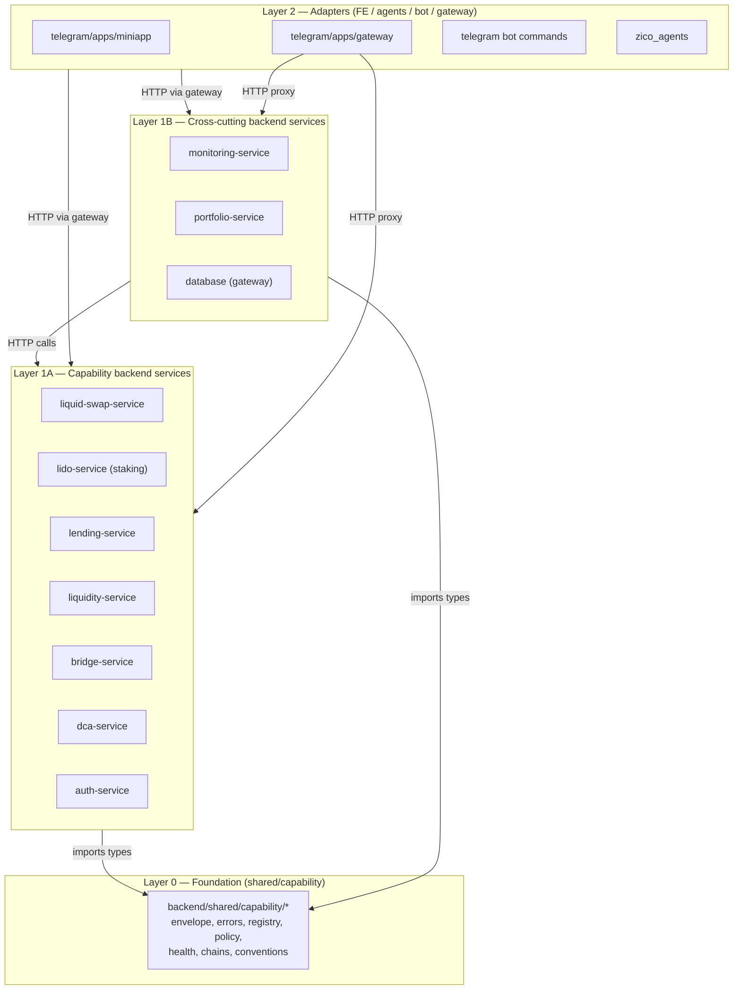

# ADR 004 — Layer dependency rules

- **Status:** Accepted
- **Date:** 2026-05-22
- **Deciders:** Panorama-Block engineering
- **Related cards:** Panorama-Block/execution-layer#77

## Context

ADR 002 introduces the Capability + Provider pattern with five layers per capability and a shared foundation in `backend/shared/capability/`. The pattern only delivers its promise (uniform shape, easy provider swap, isolated services) if the **import graph** stays one-directional.

We have lived with import inversions before: services calling each other directly (`liquid-swap-service` historically called helpers in `lending-service`), application code reaching into infrastructure of a sibling, and adapters of one service leaking types from another. Each instance survived because it was small. The aggregate cost is the current sprint: untangling those crossings is now half the work of the refactor.

This ADR fixes the rules so the cost doesn't recur.

## Decision

The system has three layers, and edges go only one direction.



### The hard rules

Every PR is checked against these. Violation = block.

1. **`backend/shared/capability/` is a sink.** It imports from nothing else inside the monorepo. External libs (zod, etc.) are fine; nothing under `backend/<service>/*` or `execution-layer/*` is allowed.
2. **No backend service imports from another backend service.** `lending-service` cannot `import { ... } from '../../liquid-swap-service/...'`. Cross-service communication is HTTP-only, through the gateway when called from outside the backend, or direct HTTP between services when both are in the cluster (cross-cutting services like `monitoring`, `portfolio` do this).
3. **Adapters import only from their own service's domain + `shared/capability/`.** `LidoProviderAdapter` (in `lido-service/infrastructure/adapters/`) imports `IStakingProvider` from `lido-service/domain/ports/` and `Transaction` from `shared/capability/`. It does *not* import from `liquid-swap-service` or `dca-service`.
4. **Domain does not import from application or infrastructure.** Ports are pure types. They can depend on `shared/capability/` types and external lib types only.
5. **The composition root (`<service>/infrastructure/di/container.ts`) is the only place that does `new <Adapter>(...)`.** Tests instantiate fakes; everywhere else receives instances by injection.
6. **No FE/agent/bot/gateway file may import from `backend/<service>/*` source.** They talk HTTP. Type-sharing happens by publishing types into a shared package (future: `@panorama/capability-types`); for this sprint, types are duplicated minimally in FE and that's acceptable.
7. **Smart contracts (`execution-layer/contracts/`) are not imported by TypeScript code.** Backend talks to deployed contract addresses via ethers + ABIs (which live in `execution-layer/backend/src/`). On-chain code is its own dependency island.

### Where to put new code (decision tree)

```
Is it a TYPE/INTERFACE used across multiple services?
  YES → backend/shared/capability/
  NO  → goes inside one service

Is it talking to an external protocol (Uniswap, Lido, Benqi, …)?
  YES → backend/<service>/src/infrastructure/adapters/<provider>.adapter.ts
  NO  → continue

Is it orchestration across multiple providers of one capability?
  YES → backend/<service>/src/application/services/<cap>.capability.service.ts
  NO  → continue

Is it an HTTP endpoint?
  YES → backend/<service>/src/infrastructure/http/{controllers,routes}/
  NO  → continue

Is it a pure domain rule (validation, entity invariant)?
  YES → backend/<service>/src/domain/
  NO  → reconsider — it probably doesn't belong in this service.
```

### Examples of accepted and rejected imports

✅ **Accepted:**
```typescript
// in lido-service/src/infrastructure/adapters/lido.provider.adapter.ts
import { IStakingProvider } from "../../domain/ports/staking.provider.port";
import { Transaction, CapabilityError } from "@panorama/shared/capability";
import { ethers } from "ethers";
```

✅ **Accepted (cross-cutting service calling capability over HTTP):**
```typescript
// in portfolio-service/src/infrastructure/adapters/cross-capability-aggregator.adapter.ts
const stakingPositions = await fetch(`${STAKING_SVC_URL}/v1/capability/staking/position/${addr}`);
```

❌ **Rejected (cross-service import):**
```typescript
// in lending-service/src/application/services/lending.service.ts
import { LidoService } from "../../../../lido-service/src/application/services/LidoService"; // BAN
```

❌ **Rejected (domain depending on infrastructure):**
```typescript
// in liquid-swap-service/src/domain/services/router.domain.service.ts
import { UniswapAdapter } from "../../infrastructure/adapters/uniswap.swap.adapter"; // BAN
```

❌ **Rejected (FE reaching into backend source):**
```typescript
// in telegram/apps/miniapp/src/features/swap/api.ts
import type { SwapQuote } from "../../../../../backend/liquid-swap-service/src/domain/entities/swap"; // BAN
```

❌ **Rejected (shared/capability reaching into a service):**
```typescript
// in backend/shared/capability/registry.ts
import { LidoService } from "../../lido-service/src/application/services/LidoService"; // BAN — capability foundation cannot know any service
```

## Consequences

### Positive

- Each service can be built, tested, deployed independently. No accidental coupling.
- Replacing a service implementation (rewrite, language change) doesn't ripple. The contract is the HTTP surface.
- Test setup is trivial: instantiate the adapter under test with mock deps; nothing pulls in 5 other services.
- The Camada 0 work in `shared/capability/` can be developed once and consumed everywhere with no risk of circular imports.

### Negative

- Some "obvious" reuses become HTTP calls. Example: lending wants to know the user's swap history to suggest a collateral; under these rules it must call `portfolio-service` over HTTP, not import from `liquid-swap-service`. The overhead is real but small (intra-cluster latency, low ms) and pays the architecture dividend.
- Type duplication between BE and FE until a `@panorama/capability-types` package exists. The duplication is shallow (request/response shapes, ~50 LOC) and the FE keeps its own validation layer.

### Neutral

- The rules are enforceable today by code review and grep; a future ESLint plugin (`eslint-plugin-boundaries` or `dependency-cruiser` config) is on the backlog. Until then, the reviewer pair (see `SPRINT_KICKOFF.md` § 11) is responsible.

## Enforcement

- **Code review check (now):** the reviewer runs `grep -r "from '\.\./\.\./.*\(liquid-swap\|lending\|lido\|dca\|bridge\|auth\)-service'" backend/<service>/src/` on changed files. Any hit → rejection with a link to this ADR.
- **CI lint (future):** add `dependency-cruiser` config in repo root that codifies the layer matrix above and fails CI on violations. Tracked as a follow-up issue in the next sprint.
- **Audit (quarterly):** run the same grep across the full monorepo. New violations → file a card to extract the offending logic into `shared/capability/` (if generic) or to add a proper HTTP edge (if not).

## References

- ADR 001 (backend-first architecture)
- ADR 002 (capability-provider abstraction) — the layered pattern this ADR pins
- ADR 003 (lane and feature taxonomy) — owners that enforce these rules
- `SPRINT_KICKOFF.md` § 3 (capability pattern in 5 layers), § 11 (review pairs)
- Existing reference impl that respects these rules: `backend/liquid-swap-service/src/domain/ports/swap.provider.port.ts` (port has no infra imports)
